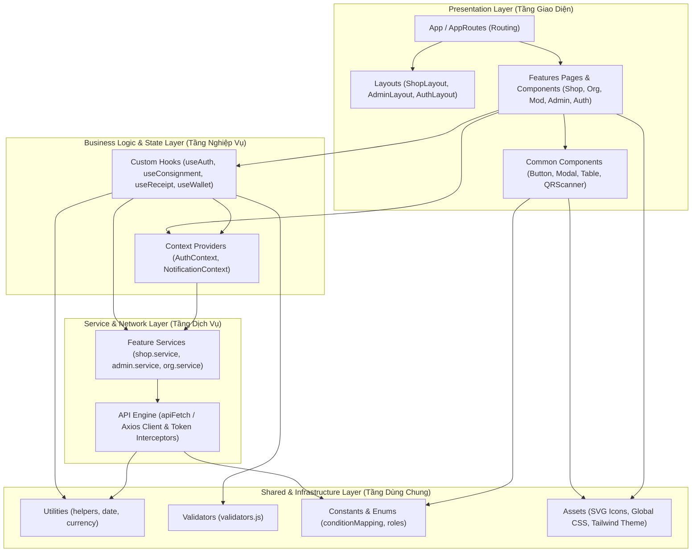

# KẾ HOẠCH TRIỂN KHAI VÀ HƯỚNG DẪN ĐIỀN "1. KIẾN TRÚC" (TÀI LIỆU FRONTEND REACTJS)

> **Tài liệu tham chiếu:**
> - File mẫu: [ReactJS_Ngân.pdf](file:///c:/Downloads/Project/FE/web/doc/ReactJS_Ngân.pdf) / [ReactJS_Ngân.md](file:///c:/Downloads/Project/FE/web/doc/ReactJS_Ngân.md)
> - Đặc tả nghiệp vụ: [ReHome.pdf](file:///c:/Downloads/Project/FE/web/doc/ReHome.pdf)
> - Mã nguồn phân tích: [FE/web](file:///c:/Downloads/Project/FE/web)

---

## I. TỔNG QUAN PHÂN TÍCH HIỆN TRẠNG MÃ NGUỒN `FE/web` & ĐẶC TẢ `ReHome`

### 1. Hiện trạng mã nguồn `FE/web`
Qua rà soát thực tế cấu trúc source code trong thư mục [FE/web](file:///c:/Downloads/Project/FE/web):
* **Core & Bundler:** Sử dụng **React 18** với **Vite** làm build tool tốc độ cao.
* **Routing:** `react-router-dom` quản lý định tuyến tập trung trong [App.jsx](file:///c:/Downloads/Project/FE/web/src/App.jsx), đã có sẵn `PrivateRoute` bảo vệ tuyến đường theo role (`admin`, `staff`, `organization`,...).
* **Giao tiếp API (Network Layer):** File [src/utils/api.js](file:///c:/Downloads/Project/FE/web/src/utils/api.js) sử dụng **Axios** (hàm `apiFetch`), hỗ trợ tự động đính kèm JWT Bearer Token, cơ chế tự động refresh token khi gặp HTTP 401, và chuẩn hóa thông báo lỗi thân thiện bằng tiếng Việt.
* **Tầng dịch vụ (Service Layer):** Đã phân tách thành các service riêng trong [src/services/](file:///c:/Downloads/Project/FE/web/src/services/) (`auth.service.js`, `shop.service.js`, `admin.service.js`, `staff.service.js`, `order.service.js`, `org.service.js`, `product.service.js`...).
* **Giao diện & Styling:** Kết hợp giữa **TailwindCSS** (`tailwindcss: 3.4.19`, `@tailwindcss/forms`) và hệ thống file CSS truyền thống trong [src/styles/](file:///c:/Downloads/Project/FE/web/src/styles/).
* **Thư viện chuyên dụng:** `@stomp/stompjs` & `sockjs-client` (Realtime Chat/Notification), `leaflet` (Bản đồ tương tác hiển thị điểm tiếp nhận).

### 2. Sự đồng bộ với đặc tả nghiệp vụ `ReHome.pdf`
Theo tài liệu nghiệp vụ [ReHome.pdf](file:///c:/Downloads/Project/FE/web/doc/ReHome.pdf) (đặc biệt là **Mục 4: Actor & Tài khoản**, **Mục 7: Các luồng nghiệp vụ**, **Mục 22: Phân chia Web & Mobile**):
* **Phân định nền tảng:**
  * **Mobile:** Dành cho `Guest` & `Member` (Người mua, Người ký gửi đồ, Người quyên góp).
  * **Web:** Tập trung phục vụ 4 Actor chính có nghiệp vụ phức tạp, cần màn hình bảng biểu lớn hoặc thao tác tại quầy:
    1. **Cửa hàng (Shop):** Lập biên nhận ký gửi (quét QR / nhập mã), đăng bán 2 nhãn ("Ký gửi từ thành viên" & "Đồ cũ của cửa hàng"), xử lý đóng gói đơn hàng, tất toán biên nhận qua PayOS khi bán ngoài sàn / mua lại, trả đồ bằng mã nhận đồ, quản lý ví & kỳ rút doanh thu. Giao diện tại quầy được thiết kế responsive ưu tiên mobile web.
    2. **Tổ chức từ thiện (Organizer):** Đăng ký/đối chiếu pháp lý, quản lý chiến dịch quyên góp, quét QR/nhập mã tiếp nhận quyên góp của Member/Shop.
    3. **Kiểm duyệt viên (Moderator):** Đối chiếu thông tin pháp lý của Cửa hàng và Tổ chức từ nguồn công khai, xử lý khiếu nại 2 tầng (tranh chấp trả hàng, đền bù mất/hỏng đồ ký gửi), xử lý vi phạm, quản lý danh mục/thương hiệu/tiêu chuẩn kiểm hàng.
    4. **Quản trị viên (Admin):** Quản lý nhân sự kiểm duyệt, khóa/mở tài khoản, cấu hình tham số hệ số phí %, trần giá 2.000.000đ, thời hạn ký gửi 50-100 ngày, kỳ rút tiền, dashboard cảnh báo và số liệu tài chính.

---

## II. NỘI DUNG HOÀN CHỈNH ĐỂ ĐIỀN VÀO "1. KIẾN TRÚC" (TRONG `ReactJS_Ngân.pdf`)

Dưới đây là nội dung chuẩn mực, đầy đủ lý luận học thuật và gắn liền với dự án thực tế để bạn điền vào mục **1. Kiến trúc** của báo cáo:

---

### **1. Kiến trúc**

**Trả lời câu hỏi:**
> **Mô hình tôi sẽ sử dụng cho Web ReactJS là: Feature-based + Layered Architecture (Kiến trúc phân tầng hướng tính năng/nghiệp vụ).**

---

#### 1.1. Lý do lựa chọn mô hình Feature-based + Layered Architecture

1. **Phù hợp với đặc thù đa phân hệ của dự án ReHome:**
   * Nền tảng Web của ReHome không phải là một trang bán lẻ đơn giản, mà là hệ thống quản trị và vận hành tập trung cho 4 nhóm tác nhân (Actors) riêng biệt: **Cửa hàng ký gửi (Shop)**, **Tổ chức từ thiện (Organizer)**, **Kiểm duyệt viên (Moderator)** và **Quản trị viên cấp cao (Admin)**.
   * Mỗi nhóm tác nhân sở hữu các luồng nghiệp vụ độc lập nhưng có mối liên kết dữ liệu chặt chẽ (Ví dụ: Cửa hàng lập biên nhận $\rightarrow$ Moderator giải quyết khiếu nại đền bù $\rightarrow$ Admin theo dõi công nợ). Việc tổ chức code theo **Feature-based** giúp nhóm mã nguồn theo từng miền nghiệp vụ cụ thể (`features/shop`, `features/organizer`, `features/moderator`, `features/admin`, `features/auth`), giúp dự án tránh được tình trạng thư mục `components/` hoặc `pages/` bị phình to (bloated) và khó bảo trì.

2. **Tách biệt rõ ràng các mối quan tâm (Separation of Concerns - SoC):**
   * Kết hợp với **Layered Architecture**, mỗi tính năng (Feature) và toàn bộ ứng dụng được phân chia thành các tầng độc lập:
     * **Presentation Layer (Tầng hiển thị):** Chỉ tập trung vào giao diện người dùng (UI), tiếp nhận sự kiện và hiển thị dữ liệu thông qua React Functional Components.
     * **Business Logic / State Layer (Tầng nghiệp vụ & trạng thái):** Xử lý luồng dữ liệu, điều kiện kiểm tra (validation), quản lý State cục bộ và toàn cục (Context API / Custom Hooks).
     * **Service / Data Access Layer (Tầng dịch vụ dữ liệu):** Phụ trách kết nối mạng, gọi API qua Axios, xử lý Interceptor, refresh token và chuẩn hóa phản hồi từ máy chủ backend.
     * **Infrastructure / Shared Layer (Tầng hạ tầng dùng chung):** Chứa các tiện ích dùng chung (Utility functions), SVG icons, mã màu thiết kế, và các hằng số hệ thống.

3. **Thuận lợi cho làm việc nhóm và mở rộng dự án (Scalability & Parallel Development):**
   * Các lập trình viên có thể phát triển song song các module nghiệp vụ khác nhau (ví dụ: một bạn làm module Cửa hàng ký gửi, một bạn làm module Moderator đối chiếu thông tin) mà không lo xung đột mã nguồn (merge conflicts).
   * Giảm thiểu mức độ phụ thuộc chéo (Coupling), tăng tính tái sử dụng (Reusability) của các thành phần giao diện dùng chung như Modal xác nhận, Bảng dữ liệu (Table), Bộ quét mã QR và Form nhập liệu.

---

#### 1.2. Chi tiết các tầng trong mô hình Layered Architecture

Mô hình phân tầng cho ứng dụng Web ReactJS được thiết kế gồm 4 tầng chính:

```
┌────────────────────────────────────────────────────────┐
│     1. Presentation Layer (Giao diện người dùng)       │
│  - Pages / Screens (ShopDashboard, ConsignmentReceipt) │
│  - Shared UI Components (Button, Modal, Table, QRScan) │
│  - Layouts (ShopLayout, AdminLayout, AuthLayout)       │
└───────────────────────────┬────────────────────────────┘
                            │ (Dispatch actions, use hooks)
┌───────────────────────────▼────────────────────────────┐
│   2. Business Logic & State Layer (Logic & Trạng thái) │
│  - Custom Hooks (useConsignment, useReceipt, useWallet)│
│  - State Management (AuthContext, SocketContext)       │
│  - Client Validation & Domain Business Rules           │
└───────────────────────────┬────────────────────────────┘
                            │ (Call service methods)
┌───────────────────────────▼────────────────────────────┐
│      3. Service / API Layer (Dịch vụ & Giao tiếp API)  │
│  - Feature Services (shop.service, admin.service)      │
│  - HTTP Client Engine (Axios / apiFetch with Token)    │
│  - Interceptors, Token Refresh, Error Formatting       │
└───────────────────────────┬────────────────────────────┘
                            │ (HTTP/HTTPS / WSS)
┌───────────────────────────▼────────────────────────────┐
│         Backend Server (Spring Boot REST API)          │
└────────────────────────────────────────────────────────┘
```

1. **Tầng Presentation (Giao diện hiển thị):**
   * Chứa các thành phần giao diện trực quan (React Components).
   * Đảm bảo tính nhất quán qua các Layout chuyên biệt: `ShopLayout` (tối ưu hiển thị tại quầy trên trình duyệt di động), `AdminLayout` (thanh điều hướng sidebar cho màn hình lớn), và `AuthLayout`.
   * Tuyệt đối không nhúng trực tiếp các logic tính toán nghiệp vụ phức tạp hoặc gọi trực tiếp Axios trong JSX; chỉ tiếp nhận props và gọi các hàm xử lý từ Custom Hook.

2. **Tầng Business Logic & State (Nghiệp vụ & Quản lý trạng thái):**
   * **Context API:** Lưu trữ trạng thái toàn cục như phiên đăng nhập (`AuthContext`), thông tin người dùng và quyền hạn (RBAC - Role Based Access Control), kênh kết nối thông báo thời gian thực (`NotificationContext`).
   * **Custom Hooks:** Đóng gói toàn bộ logic tương tác nghiệp vụ. Ví dụ: `useConsignmentReceipt` chứa logic kiểm tra checklist tiêu chí đồ cũ, tính toán mức phí chia sẻ, gửi biên nhận điện tử cho Member xác nhận; `useWallet` kiểm tra số dư và kích hoạt cổng PayOS khi ví âm.

3. **Tầng Service / API (Dịch vụ kết nối mạng):**
   * Đóng gói toàn bộ điểm cuối API (Endpoints) thành các hàm bất đồng bộ (`async/await`).
   * Sử dụng Axios làm HTTP Client chính kết hợp cơ chế tự động đính kèm `Bearer token` trong Header, bắt lỗi HTTP Status (401, 403, 404, 500) và tự động gọi API Refresh Token để duy trì phiên làm việc liền mạch.
   * Chuẩn hóa dữ liệu đầu ra trước khi trả về cho UI/Hook tiêu thụ.

4. **Tầng Shared / Common (Thành phần dùng chung):**
   * Chứa các hàm tiện ích tái sử dụng (`formatCurrencyVND`, `formatDateTime`, `calculateConsignmentFee`).
   * Hệ thống định nghĩa trạng thái và nhãn (`conditionMapping.js`: "Còn tem", "Như mới", "Tốt", "Có khuyết điểm").
   * Bộ quy chuẩn xác thực form dữ liệu (`validators.js`).

---

#### 1.3. Phân chia cấu trúc theo miền nghiệp vụ (Feature-based Breakdown) dựa trên `ReHome.pdf`

Hệ thống Web được tổ chức thành các Feature đại diện cho từng nghiệp vụ cốt lõi:

| Feature Module | Tác nhân chính (Actor) | Nghiệp vụ cụ thể trong ReHome | Thành phần mã nguồn tương ứng |
| :--- | :--- | :--- | :--- |
| **`auth`** | Toàn bộ Actor | Đăng nhập đa vai trò, đăng ký thông tin pháp lý (Cửa hàng/Tổ chức), xác thực JWT, phân quyền Route Guard. | `LoginPage`, `RegisterShop`, `RegisterOrg`, `AuthContext`, `auth.service.js` |
| **`shop`** | Cửa hàng (Shop) | - **Tại quầy:** Quét mã QR/mã 8 số của Member, kiểm tra tiêu chí đồ cũ, chụp ảnh nhãn, lập biên nhận ký gửi.<br>- **Quản lý kho:** Theo dõi trạng thái món ký gửi (Chờ xác nhận, Chờ đăng, Đang bán, Chờ tất toán, Chờ trả đồ).<br>- **Bán ngoài sàn / Mua lại:** Tất toán biên nhận qua PayOS trong 48 giờ để chuyển tiền vào ví người ký gửi.<br>- **Trả đồ:** Quét mã nhận đồ 6 số đóng biên nhận.<br>- **Bán hàng:** Đăng bán 2 nhãn ("Ký gửi từ thành viên" và "Đồ cũ của cửa hàng"). | `ReceiptCreationPage`, `ShopConsignmentsPage`, `ProductListingForm`, `PackagingModal`, `shop.service.js` |
| **`organizer`** | Tổ chức từ thiện | - Khai báo thông tin đối chiếu pháp lý.<br>- Tạo và quản lý chiến dịch kêu gọi quyên góp quần áo.<br>- Quét mã QR / nhập mã ghi nhận lượt quyên góp của Member hoặc Shop.<br>- Đăng tải bài viết cập nhật tiến độ hoạt động. | `CampaignManagementPage`, `DonationCheckInPage`, `OrgProfilePage`, `org.service.js` |
| **`moderator`** | Kiểm duyệt viên | - Đối chiếu thông tin pháp lý (MST, tên doanh nghiệp, địa chỉ) của Cửa hàng & Tổ chức với nguồn công khai, lưu bằng chứng.<br>- Phân xử khiếu nại 2 tầng: Tranh chấp trả hàng giữa người mua và shop; khiếu nại đền bù của người ký gửi (mất đồ, hỏng đồ, nợ bán ngoài sàn).<br>- Quản lý danh mục thương hiệu tầm trung & bảng tiêu chí kiểm hàng. | `VerificationQueuePage`, `DisputeResolutionPage`, `CategoryBrandPage`, `staff.service.js` |
| **`admin`** | Quản trị viên (Admin) | - Quản lý danh sách tài khoản & phân quyền Moderator.<br>- Khóa/Mở khóa Cửa hàng & Tổ chức theo đề xuất của Moderator.<br>- Cấu hình tham số hệ thống: tỷ lệ phí %, trần giá 2.000.000đ, hạn ký gửi 50-100 ngày, hạn đăng 5 ngày, kỳ rút tiền 1 & 16 hàng tháng.<br>- Dashboard tổng quan số liệu tài chính & cảnh báo vi phạm. | `AdminDashboardPage`, `SystemConfigPage`, `AccountManagementPage`, `admin.service.js` |
| **`wallet`** | Shop, Moderator, Admin | - Quản lý số dư doanh thu giữ hộ.<br>- Lịch sử biến động số dư.<br>- Kỳ rút tiền tự động (giả lập).<br>- Cảnh báo ví âm và quy trình nạp bù qua PayOS. | `WalletOverviewPage`, `PayoutHistoryPage`, `wallet.service.js` |
| **`orders`** | Shop, Moderator | Quản lý vòng đời đơn hàng: Xác nhận đơn, chụp ảnh đóng gói, đẩy sang Delivery Service giả lập, đếm ngược 3 ngày hoàn tất và tự động chia tiền vào ví. | `OrderManagementPage`, `ShippingModal`, `order.service.js` |

---

## III. NỘI DUNG HOÀN CHỈNH CHO CÁC MỤC LIÊN QUAN TRONG TÀI LIỆU THIẾT KẾ

Để giúp bạn hoàn thiện đồng bộ toàn bộ tài liệu [ReactJS_Ngân.pdf](file:///c:/Downloads/Project/FE/web/doc/ReactJS_Ngân.pdf), dưới đây là nội dung chuẩn bị sẵn cho **Mục 2, Mục 3 và Mục 4**:

---

### **2. Package Diagram (Sơ đồ gói)**

Sơ đồ Package Diagram thể hiện mối quan hệ phụ thuộc giữa các package trong ứng dụng Web ReactJS theo chuẩn Feature-based + Layered Architecture:



*(Bạn có thể xuất ảnh sơ đồ Mermaid trên hoặc vẽ lại theo công cụ StarUML / draw.io để dán vào trang 2 của tài liệu).*

---

### **3. Thư viện cốt lõi (Dependencies)**

Bảng thông tin các thư viện chính xác đang được sử dụng trong mã nguồn [FE/web/package.json](file:///c:/Downloads/Project/FE/web/package.json) và mã nguồn thực tế:

| Chức năng | Thư viện sử dụng | Phiên bản / Ghi chú |
| :--- | :--- | :--- |
| **Gọi API (HTTP Client)** | `Axios` | Đóng gói trong `src/utils/api.js`, xử lý tự động đính kèm JWT Bearer Token, cơ chế Refresh Token khi 401, và chuẩn hóa thông báo lỗi tiếng Việt. |
| **Chuyển trang (Routing)** | `React Router DOM` | Quản lý định tuyến SPA (Single Page Application), điều hướng phân quyền `PrivateRoute` dựa trên vai trò người dùng (Role-Based Access Control). |
| **Form & Validate** | `React Hook Form` & Custom Validation Utilities | Xử lý kiểm tra tính hợp lệ dữ liệu trực tiếp tại Client (`src/utils/validators.js`), kiểm tra định dạng email, mật khẩu, số điện thoại và tiêu chuẩn kiểm hàng. |
| **UI Framework / Styling** | `TailwindCSS` (v3.4.19) & `@tailwindcss/forms` | Hệ thống thiết kế linh hoạt, tiện ích Utility-first CSS, tối ưu giao diện Responsive cho màn hình máy tính và thiết bị di động tại quầy. |
| **Giao tiếp Realtime** | `@stomp/stompjs` & `sockjs-client` | Kết nối WebSocket nhận thông báo cập nhật trạng thái đơn hàng, biên nhận, khiếu nại và chat hỗ trợ thời gian thực. |
| **Bản đồ tương tác** | `Leaflet` | Hiển thị vị trí cửa hàng ký gửi và điểm tiếp nhận chiến dịch quyên góp của các tổ chức từ thiện. |

---

### **4. Cấu trúc thư mục (Folder Structure)**

Cấu trúc thư mục chuẩn mực của dự án [FE/web/src](file:///c:/Downloads/Project/FE/web/src) được tổ chức theo **Feature-based + Layered Architecture**:

```text
src/
├── assets/                       # Tài nguyên tĩnh cục bộ (hình ảnh, logo, icons SVG dùng chung)
│   ├── icons/                    # Bộ icon SVG tập trung (icon-verified, icon-eco,...)
│   └── images/                   # Hình ảnh minh họa, banner
├── components/                   # Các UI Dumb Components dùng chung toàn hệ thống
│   ├── common/                   # Button, Input, Modal, Badge, Dropdown, Table
│   ├── ConfirmModal.jsx          # Modal xác nhận thao tác quan trọng (xóa, hủy, đổi trạng thái)
│   ├── header.jsx                # Header thanh điều hướng chung
│   ├── footer.jsx                # Chân trang hệ thống
│   ├── chat.jsx                  # Khung chat hỗ trợ trực tuyến
│   └── QRScannerModal.jsx        # Component quét mã QR hoặc nhập mã số thay thế
├── configs/                      # Cấu hình hằng số hệ thống
│   ├── api.config.js             # Cấu hình Base URL và danh sách API Endpoints
│   └── role.config.js            # Danh sách quyền hạn người dùng (SHOP, ORG, MODERATOR, ADMIN)
├── context/                      # Quản lý trạng thái toàn cục (React Context API)
│   ├── AuthContext.jsx           # Lưu trữ token, phiên làm việc và thông tin Actor đăng nhập
│   └── NotificationContext.jsx   # Quản lý chuông thông báo và kết nối WebSocket realtime
├── features/                     # CÁC MODULE NGHIỆP VỤ CỐT LÕI (Feature-based)
│   ├── auth/                     # Phân hệ Xác thực & Đăng ký
│   │   ├── pages/                # Login, RegisterShop, RegisterOrg, ForgotPassword
│   │   └── services/             # auth.service.js
│   ├── shop/                     # Phân hệ Cửa hàng Ký gửi (Dành cho Actor: Shop)
│   │   ├── components/           # Bảng tiêu chí kiểm hàng, form tất toán PayOS, camera tại quầy
│   │   ├── pages/                # Lập biên nhận, Quản lý món ký gửi, Đăng bán 2 nhãn, Trả đồ
│   │   └── services/             # shop.service.js (API lập biên nhận, đổi giá, tất toán PayOS)
│   ├── organizer/                # Phân hệ Tổ chức từ thiện (Dành cho Actor: Organizer)
│   │   ├── pages/                # Quản lý chiến dịch, Ghi nhận quyên góp (quét QR/mã số)
│   │   └── services/             # org.service.js (API chiến dịch, xác nhận quyên góp)
│   ├── moderator/                # Phân hệ Kiểm duyệt & Phân xử (Dành cho Actor: Moderator)
│   │   ├── pages/                # Đối chiếu pháp lý Shop/Org, Phân xử khiếu nại 2 tầng, Báo cáo
│   │   └── services/             # staff.service.js, audit.service.js
│   ├── admin/                    # Phân hệ Quản trị tối cao (Dành cho Actor: Admin)
│   │   ├── pages/                # Dashboard doanh thu, Cấu hình phí/trần giá, Khóa tài khoản
│   │   └── services/             # admin.service.js
│   ├── orders/                   # Phân hệ Đơn hàng & Vận chuyển
│   │   ├── components/           # Modal tải ảnh đóng gói, theo dõi mã vận đơn
│   │   └── services/             # order.service.js
│   └── wallet/                   # Phân hệ Ví & Tài chính
│       ├── components/           # Bảng lịch sử biến động số dư, cảnh báo ví âm
│       └── services/             # wallet.service.js (Rút tiền kỳ, nạp bù PayOS)
├── hooks/                        # Custom React Hooks dùng chung
│   ├── useConfirm.jsx            # Hook điều khiển mở/đóng và callback cho ConfirmModal
│   ├── useDebounce.js            # Hook tối ưu tìm kiếm sản phẩm và tra cứu mã
│   └── useQRScanner.js           # Hook điều khiển thiết bị Camera và giải mã QR code
├── layouts/                      # Khung bố cục giao diện (Layout Wrappers)
│   ├── ShopLayout.jsx            # Layout tối ưu cho cửa hàng (hỗ trợ responsive tại quầy)
│   ├── AdminLayout.jsx           # Layout chuẩn cho Quản trị viên và Moderator (Sidebar + Navbar)
│   └── AuthLayout.jsx            # Layout tinh gọn cho các trang đăng nhập/đăng ký
├── routes/                       # Quản lý định tuyến và điều hướng (React Router)
│   ├── AppRouter.jsx             # File tổng hợp gom tất cả Routes của ứng dụng
│   └── PrivateRoute.jsx          # Component bọc bảo vệ route theo vai trò (RBAC)
├── services/                     # Tầng kết nối mạng trung tâm
│   └── baseApi.js                # Instance cấu hình Axios và Interceptor xử lý JWT
├── styles/                       # CSS toàn cục và định dạng tùy chỉnh
│   ├── global.css                # CSS thiết lập nền tảng, biến màu HSL
│   └── tailwind.css              # Tích hợp Tailwind Directives (@tailwind base; components; utilities;)
├── utils/                        # Các hàm tiện ích hỗ trợ (Pure Functions)
│   ├── api.js                    # apiFetch bọc axios, formatApiError xử lý lỗi tiếng Việt
│   ├── validators.js             # Hàm kiểm tra định dạng email, SĐT, mật khẩu, form hợp lệ
│   ├── conditionMapping.js       # Mapping 4 tình trạng quần áo ("Còn tem", "Như mới", "Tốt", "Có khuyết điểm")
│   └── formatters.js             # Hàm định dạng tiền tệ VNĐ (ví dụ: 2.000.000 đ), định dạng ngày tháng
├── App.jsx                       # Root Component (khởi tạo Router và Context Providers)
└── main.jsx                      # Điểm khởi chạy của ứng dụng React với Vite
```

---

## IV. BẢNG CHECKLIST CÁC BƯỚC ĐIỀN VÀO FILE BÁO CÁO CỦA BẠN

Để nộp bài hoặc cập nhật vào file Word/PDF:
1. **Bước 1 (Phần 1. Kiến trúc):** Sao chép toàn bộ nội dung ở **Mục II** (gồm: Câu trả lời chọn mô hình, 3 lý do lựa chọn, phân tích chi tiết 4 tầng Layered, và bảng phân chia Feature-based theo nghiệp vụ ReHome).
2. **Bước 2 (Phần 2. Package Diagram):** Xuất sơ đồ Mermaid ở **Mục III.2** thành hình ảnh PNG hoặc vẽ lại trên Draw.io rồi chèn vào khung `[CHÈN HÌNH ẢNH SƠ ĐỒ VÀO ĐÂY]`.
3. **Bước 3 (Phần 3. Thư viện cốt lõi):** Điền chính xác bảng ở **Mục III.3** vào bảng mục 3 của bạn (Axios, React Router DOM, React Hook Form, TailwindCSS,...).
4. **Bước 4 (Phần 4. Cấu trúc thư mục):** Chèn cây thư mục chi tiết ở **Mục III.4** vào phần cấu trúc thư mục để hoàn thiện toàn bộ tài liệu thiết kế một cách chỉn chu và đạt điểm tối đa!
